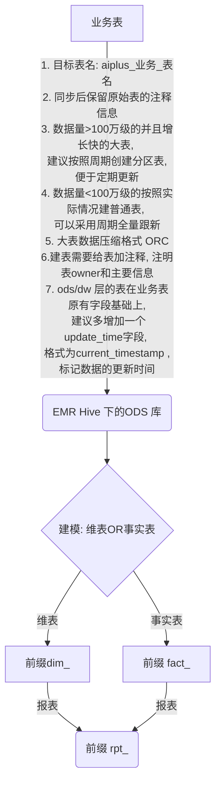
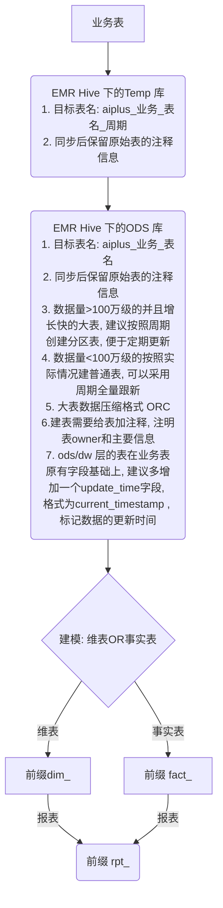
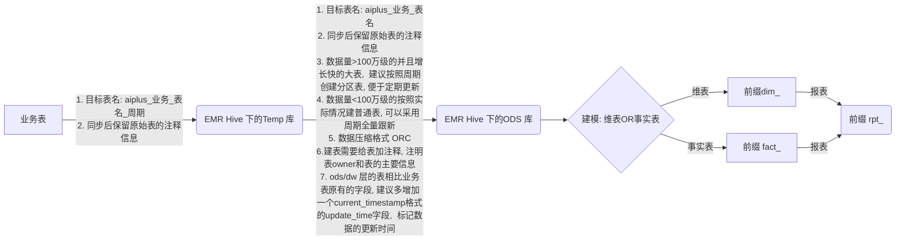
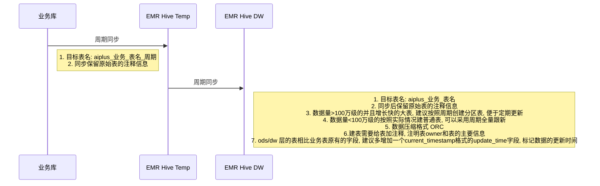

# mermaid

## flow chart

> 用` `时，预览是正常的，下载 svg 会报错

### graph TD

### graph TD 2

### graph LR

## sequenceDiagram

### 参考

[mermaid-live-editor](https://mermaidjs.github.io/mermaid-live-editor)